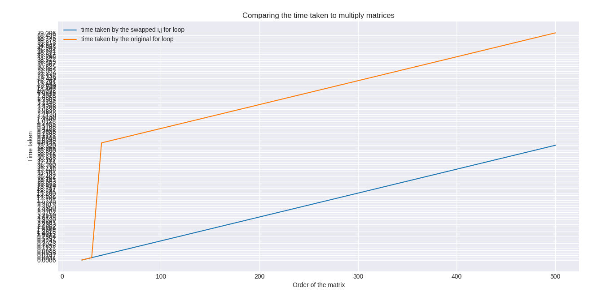
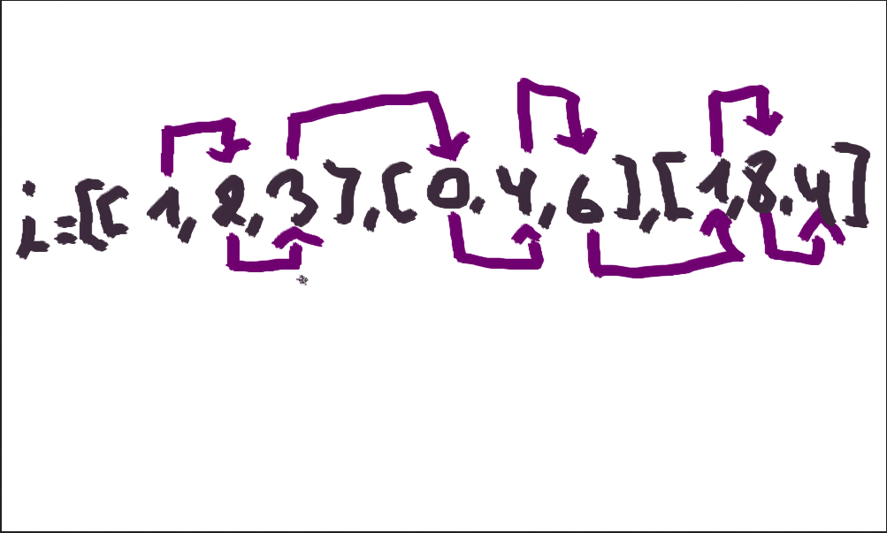
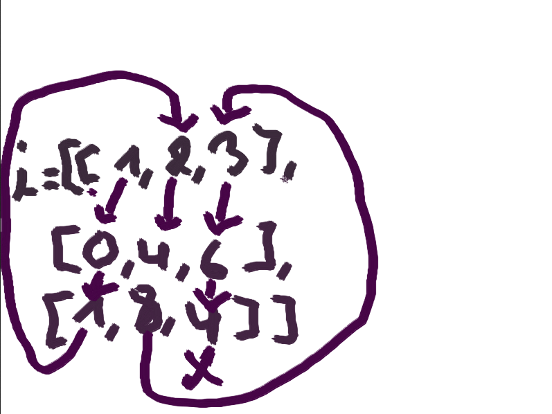

# Space-bound--ravel
Space bound computation task
If we change the ordering of i and j in the looping(i, j to j, i) we get this plot:<br>
<br>
As you can see the time taken by the original for loop is much more than the time taken by the swapped one but just by 4 seconds on the 500x500 matrix for example...
## What is ravel?
Ravel is a numpy function that returns a flattened(flattened means it goes back as a 1d array) array in 'C' style order or in 'fortran' style order
## what is row major ordering?

Row major ordering is when a matrice is ordered in 'c' style orderwith the last axis index changing fastest, back to the first axis index,
here is a little code for it:
```
>>> import numpy as np
>>> i=[[1,2,3],[0,4,6],[1,8,4]]
>>> np.ravel(i,order='A')
[1,2,3,0,4,6,1,8,4] # as you can see the array was flattened
```
You can think of it as a matrix and you start by first ordering the first row and so on until the last one.
And here is the image representation for you to get an idea of it:<br>
<br>
## what is column major ordering
Row major ordering is when a matrice is ordered in 'fortran' style order with  the first index changing fastest, and the last index changing slowest, you can think of it as a matrix and you start by first ordering the first column and so on until the last one.
```
>>> import numpy as np
>>> i=[[1,2,3],[0,4,6],[1,8,4]]
>>> np.ravel(i,order='F')
[1,0,1,2,4,8,3,6,4]  
```
And here is another image illustration:<br>

